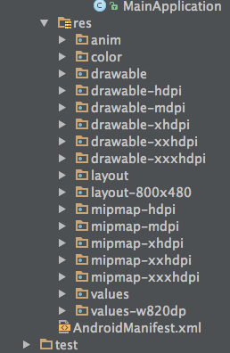

# RN集成到原生项目
***
> 集成是双向的，RN很好的解决了这个问题。原生项目中使用RN开发还是很方便的。


## IOS
 
### 原生混和开发：
#### 一、开发配置

> [参考](http://www.jianshu.com/p/3dc9d70a790f)

##### 1. IOS项目中搭建RN开发环境(见参考)
##### 2. 创建package.json
<!--more-->
```
{
  "name": "MyRNApp",
  "version": "0.0.1",
  "private": true,
  "scripts": {
    "start": "node node_modules/react-native/local-cli/cli.js start"
  },
  "dependencies": {
    "react": "15.2.1",
    "react-native": "0.31.0"
  }
}
====> npm install 	
```
##### 3. 安装CocoaPods

```objc
# Uncomment this line to define a global platform for your project
# platform :ios, '9.0'

target 'MyRNApp' do
  # Uncomment this line if you're using Swift or would like to use dynamic frameworks
  # use_frameworks!

  # Pods for MyRNApp

    pod 'React', :path => 'node_modules/react-native', :subspecs => [
    'ART',
    'RCTActionSheet',
    'RCTAdSupport',
    'RCTGeolocation',
    'RCTImage',
    'RCTNetwork',
    'RCTPushNotification',
    'RCTSettings',
    'RCTText',
    'RCTVibration',
    'RCTWebSocket',
    'RCTLinkingIOS'
    # Add any other subspecs you want to use in your project
    ]

  target 'MyRNAppTests' do
    inherit! :search_paths
    # Pods for testing
  end

  target 'MyRNAppUITests' do
    inherit! :search_paths
    # Pods for testing
  end

end

注意path的路径设置,默认根目录,也可文件夹中
====> pod install 喽~
```

#### 二、开始开发

##### 1. 创建index.ios.js

```
'use strict';
import React, {Component} from 'react'
	
import {
    Text,
    View,
    AppRegistry
} from 'react-native';
	
class NativeRNApp extends React.Component {
  render() {
    return (
      <View >
        <Text>This is a simple application.</Text>
      </View>
    )
  }
}
AppRegistry.registerComponent('NativeRNApp', () => NativeRNApp);
```

##### 2. 设置JS入口

> 注: 可以直接就设置到默认的ViewController,也可以自己写个ReactViewController

```objc
@implementation ViewController
	
- (void)viewDidLoad {
    [super viewDidLoad];
    [self initRNView];
   }
	
- (void)didReceiveMemoryWarning {
    [super didReceiveMemoryWarning];
}
	
-(void)initRNView {
   NSString * strUrl = @"http://localhost:8081/index.ios.bundle?platform=ios&dev=true";
    NSURL * jsCodeLocation = [NSURL URLWithString:strUrl];
	
    RCTRootView * rootView = [[RCTRootView alloc] initWithBundleURL:jsCodeLocation
                                                         moduleName:@"NativeRNApp"
                                                  initialProperties:nil
                                                      launchOptions:nil];
    self.view = rootView;
}
	
===> moduleName:@"NativeRNApp" 注意这个名称要和index.ios.js 中的对应上
```

##### 3. 一些问题记录
> [参考](http://blog.csdn.net/u014410695/article/details/50635842)

报错: App Transport Security has blocked a cleartext HTTP (http://) resource load since it is insecure 报错原因是需要开启内网http的访问权限（iOS9之后会有这个问题）。
> 在Info.plist中添加 NSAppTransportSecurity 类型 Dictionary ; 
在 NSAppTransportSecurity 下添加 NSAllowsArbitraryLoads 类型Boolean ,值设为 YES; 
参考地址：

-

报错：RCTStatusBarManager module requires that the UIViewControllerBasedStatusBarAppearance key in the Info.plist is set to NO 错误信息说的很清楚了。
> 在Info.plist中添加View controller-based status bar appearance为NO。
http://www.cnblogs.com/chglog/p/4746683.html


应该还要在项目中设置node_modules的查找路径的...忘了在哪设置的了
***
### 集成已有RN模块(jsbundle)：

> RN的项目直接作为模块嵌入到已有项目中

#### 一、开发配置

> 同上

#### 二、开始开发

##### 2-1 RNApp 打包jsbundle及资源文件

> [参考](http://tutudev.com/2016/05/11/code-push-tutorial/)

###### 打包： 
- (仅JS)

> react-native bundle --parameter ios --entry-file index.ios.js --bundle-output ./testCodePush/APP_task010001.js

- (包含图片等资源)

> react-native bundle --parameter ios --entry-file index.ios.js --bundle-output ./bundles/SwitchCheck010004.js --assets-dest ./bundles

##### 2-2 嵌入原生项目
- 把打包出来的jsbundle及assets复制到项目根目录
- 更改入口文件

```objc
-(void)initRNView {
    NSURL *jsCodeLocation;
    jsCodeLocation = [[NSBundle mainBundle] URLForResource:@"main" withExtension:@"jsbundle"];
    RCTRootView *rootView = [[RCTRootView alloc] initWithBundleURL:jsCodeLocation
                                                        moduleName:@"JucaiApp"
                                                 initialProperties:nil
                                                     launchOptions:nil];
    CGRect rect = [[UIScreen mainScreen] bounds];
    rootView.frame = CGRectMake(0, 0, rect.size.width, rect.size.height);
    [self.view addSubview:rootView];
}
===> 同样注意程序入口名称JucaiApp
```
	
> 注：如果遇到确实某个RN项目package.json中配置的第三方依赖模块缺失，则需要在手动加到现有原生项目中(podfile维护即可)，但正常情况下是不需要滴.

差一个目录的截图

## Android

#### 原生混和开发：
#### 一、开发配置

- 创建package.json 文件并npm install

```
dependencies {
	compile "com.facebook.react:react-native:+"
	compile 'com.android.support:appcompat-v7:23.4.0'
	compile fileTree(dir: "libs", include: ["*.jar"])
	compile project(':@remobile/react-native-toast')
}
==> 要用的库这样加进去,也可以Open Model Setting 添加依赖
```

- MainApplication 实现 ReactApplication并重载相关方法

```java
//facebook/react/ReactNativeHost.java
protected String getJSMainModuleName() {
	return "index.android";
}
protected @Nullable String getBundleAssetName() {
	return "index.android.bundle";
}
==> 0.28or0.29以后就默认情况下就会默认设定加载，具体可参考ReactNativeHost.java
```
- build.gradle 添加设置node_modules的路径

```
allprojects {
    repositories {
        mavenLocal()
        jcenter()
        maven {
            // All of React Native (JS, Obj-C sources, Android binaries) is installed from npm
            url "$rootDir/../node_modules/react-native/android"
        }
    }
}

```
暂未做在混合开发中配置RN DEBUG 方式，可以查看ReactNativeHost.java 配置即可

#### 二、开始开发

##### 2-1 创建index.android.js
> 如果入口文件配置OK则就可看到RN开发页面了.

> 同样，用RN开发的模块应该放在单独的目录中.

---
#### 集成已有RN模块(jsbundle)：
#### 一、开发配置

> 同样和IOS配置一样，这里需要android项目搭建好基本的RN开发环境


#### 二、开始开发

##### 2-1 打包jsbundle及资源文件

打包命令：
```
react-native bundle android --entry-file index.android.js --bundle-output ./bundles/index.android.bundle.js --assets-dest ./bundles --dev false

```
> 同样，打包完毕后会有一些图片的资源文件夹，直接复制到res目录中



##### 2-2 配置加载的jsbundle

```
@Override
protected String getBundleAssetName(){
    return "main.jsbundle";
}

```

### 到此，原生中集成RN开发流程就完成啦！
> 参考项目后面会做


